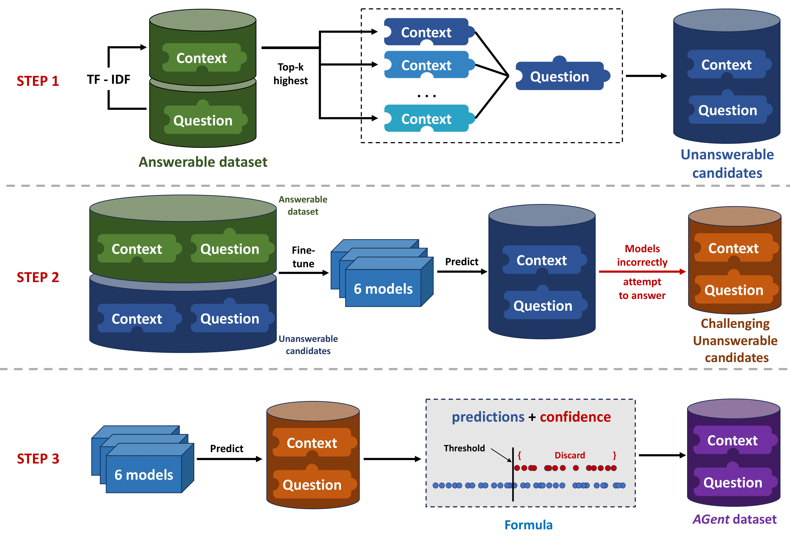
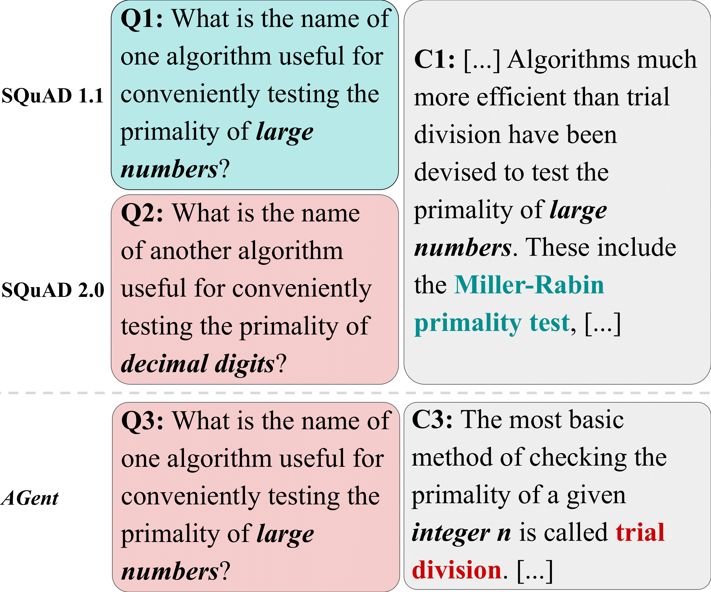

# AGent: A Novel Pipeline for Automatically Creating Unanswerable Questions
## Introduction
This repository contains the source code for the AGent pipeline described in the following paper:
>**AGent: A Novel Pipeline for Automatically Creating Unanswerable Questions**<br>
>Son Quoc Tran, Gia-Huy Do, Phong Nguyen-Thuan Do, Matt Kretchmar, Xinya Du<br>
>Computer Science Department, Denison University, Granville, Ohio<br>
>The UIT NLP Group, Vietnam National University, Ho Chi Minh City<br>
>University of Texas at Dallas



## 1. Getting Started
```
conda create -n agent -y python=3.9.12
conda activate agent
pip install -r requirements.txt
```

## 2. Preparing Data

## 3. AGent

Agent pipeline has three steps:<br>
    1. Matching questions with new contexts.<br>
    2. Identifying hard unanswerable questions.<br>
    3. Filtering out answerable questions.<br>
### Step 1
This step is mostly adopted from the repository of [DrQA](https://github.com/facebookresearch/DrQA) by [Danqi Chen et al., 2017](https://aclanthology.org/P17-1171/).

Code for this step is in `src/step1`. Refer to `src/step1/README.md` for further instructions.
### Step 2
#### Train Adversarial Models
#### Get Challenging Unanswerable Candidates
Use notebook `src/step2.ipynb` to finalize the Agent dataset
### Step 3
Use notebook `src/step3.ipynb` to tune the formula and finalize the Agent dataset

## Citation and Contact
If you found this repository helpful, please cite:
```
BibText here
```
Please contact Son Quoc Tran at `tran_s2@denison.edu` if you have any questions.

